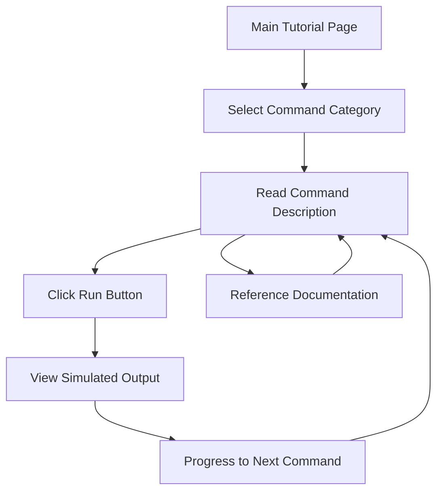

# Claude Code Tutorial Web Application - Product Requirements Document

## 1. Product Overview

An interactive web application designed to teach beginners Claude Code commands and best practices through a simulated terminal interface. The application provides a hands-on learning experience with pre-configured commands and mocked outputs, eliminating the need for actual Claude Code installation while maintaining an authentic command-line feel.

Target users are developers and technical professionals new to Claude Code who want to learn commands, hooks, and best practices in a safe, guided environment. The product aims to reduce the learning curve and increase adoption of Claude Code by providing an accessible, risk-free learning platform.

## 2. Core Features

### 2.1 User Roles

No user registration or role distinction is required. All users have the same access level as learners.

### 2.2 Feature Module

Our Claude Code tutorial application consists of the following main pages:

1. **Main Tutorial Page**: Terminal-style interface, command categories, progress tracking, interactive command execution simulation.

### 2.3 Page Details

| Page Name | Module Name | Feature Description |
|-----------|-------------|---------------------|
| Main Tutorial Page | Header Section | Display application title, progress indicator, and navigation between tutorial sections |
| Main Tutorial Page | Command Categories | Organize commands into logical groups: Basic Commands, File Operations, Hooks Management, Advanced Features |
| Main Tutorial Page | Terminal Interface | iTerm2-styled terminal window with dark background, green text, and authentic command prompt styling |
| Main Tutorial Page | Command Display | Show pre-configured Claude commands with syntax highlighting and clear descriptions |
| Main Tutorial Page | Interactive Execution | Provide "Run" buttons for each command that simulate execution with pre-mocked realistic outputs |
| Main Tutorial Page | Progress Tracking | Track user progress through tutorial sections and mark completed commands |
| Main Tutorial Page | Documentation Panel | Display contextual explanations, best practices, and links to official Claude documentation |

## 3. Core Process

User Learning Flow:
1. User accesses the main tutorial page
2. User selects a command category (Basic, File Operations, Hooks, Advanced)
3. User reads command description and explanation
4. User clicks "Run" button to simulate command execution
5. System displays pre-mocked output in terminal interface
6. User progresses through commands from simple to complex
7. System tracks progress and provides feedback
8. User can reference documentation panel for additional context

## 4. User Interface Design

### 4.1 Design Style

- **Primary Colors**: Dark background (#1e1e1e), bright green text (#00ff00), white highlights (#ffffff)
- **Secondary Colors**: Gray borders (#444444), blue accents (#007acc), yellow warnings (#ffff00)
- **Button Style**: Rounded corners with subtle hover effects, terminal-inspired styling
- **Font**: Monospace fonts (Monaco, Consolas, 'Courier New') for authentic terminal feel
- **Layout Style**: Single-page application with sidebar navigation and main terminal area
- **Icons**: Minimalist terminal and command-line inspired icons, folder and file symbols

### 4.2 Page Design Overview

| Page Name | Module Name | UI Elements |
|-----------|-------------|-------------|
| Main Tutorial Page | Header Section | Dark header bar with green accent, application logo, progress bar with completion percentage |
| Main Tutorial Page | Command Categories | Left sidebar with expandable sections, hover effects, category icons |
| Main Tutorial Page | Terminal Interface | Full-width terminal window with authentic prompt styling, scrollable output area |
| Main Tutorial Page | Command Display | Syntax-highlighted command text, description boxes with rounded corners |
| Main Tutorial Page | Interactive Execution | Green "Run" buttons with terminal styling, loading animations during simulation |
| Main Tutorial Page | Documentation Panel | Right sidebar with collapsible sections, clean typography, external link styling |

### 4.3 Responsiveness

Desktop-first design with mobile-adaptive layout. On smaller screens, sidebar navigation collapses into hamburger menu, and terminal interface adjusts to single-column layout. Touch interaction optimization for mobile "Run" buttons and scrollable content areas.