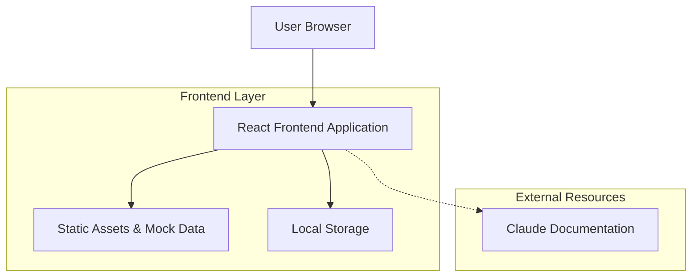

# Claude Code Tutorial Web Application - Technical Architecture Document

## 1. Architecture Design



## 2. Technology Description

* Frontend: React\@18 + TypeScript + Tailwind CSS\@3 + Vite

* State Management: React Context API + useReducer

* Styling: Tailwind CSS with custom terminal theme

* Build Tool: Vite for fast development and optimized builds

* Package Manager: npm

## 3. Route Definitions

| Route                 | Purpose                                                           |
| --------------------- | ----------------------------------------------------------------- |
| /                     | Main tutorial page with terminal interface and command categories |
| /category/:categoryId | Deep link to specific command category section                    |
| /command/:commandId   | Deep link to specific command with pre-loaded context             |

## 4. Component Architecture

### 4.1 Core Components

```typescript
// Main application state interface
interface AppState {
  currentCategory: string;
  completedCommands: string[];
  currentCommand: string | null;
  terminalHistory: TerminalEntry[];
}

// Terminal entry interface
interface TerminalEntry {
  id: string;
  command: string;
  output: string;
  timestamp: Date;
  type: 'command' | 'output' | 'error';
}

// Command definition interface
interface ClaudeCommand {
  id: string;
  name: string;
  syntax: string;
  description: string;
  category: string;
  difficulty: 'beginner' | 'intermediate' | 'advanced';
  mockOutput: string;
  explanation: string;
  bestPractices: string[];
  relatedCommands: string[];
}
```

### 4.2 Component Structure

```
App
├── Header
│   ├── Logo
│   ├── ProgressBar
│   └── ThemeToggle
├── MainContent
│   ├── Sidebar
│   │   ├── CategoryList
│   │   └── CommandList
│   ├── TerminalInterface
│   │   ├── TerminalHeader
│   │   ├── TerminalOutput
│   │   └── CommandInput
│   └── DocumentationPanel
│       ├── CommandDescription
│       ├── BestPractices
│       └── ExternalLinks
└── Footer
```

## 5. Data Model

### 5.1 Mock Data Structure

```typescript
// Command categories with progressive difficulty
const commandCategories = {
  basic: {
    id: 'basic',
    name: 'Basic Commands',
    description: 'Essential Claude Code commands for beginners',
    commands: ['help', 'version', 'init', 'status']
  },
  fileOps: {
    id: 'fileOps',
    name: 'File Operations',
    description: 'Commands for file and project management',
    commands: ['create', 'edit', 'view', 'delete']
  },
  hooks: {
    id: 'hooks',
    name: 'Hooks Management',
    description: 'Setting up and managing Claude Code hooks',
    commands: ['hooks', 'hook-add', 'hook-remove', 'hook-list']
  },
  advanced: {
    id: 'advanced',
    name: 'Advanced Features',
    description: 'Complex workflows and optimization techniques',
    commands: ['config', 'debug', 'optimize', 'integrate']
  }
};

// Sample command definitions
const claudeCommands: ClaudeCommand[] = [
  {
    id: 'help',
    name: '/help',
    syntax: '/help [command]',
    description: 'Display help information for Claude Code commands',
    category: 'basic',
    difficulty: 'beginner',
    mockOutput: `Available commands:\n/help - Show this help message\n/hooks - Manage hooks configuration\n/status - Show current session status\n/clear - Clear the terminal`,
    explanation: 'The help command is your starting point for discovering Claude Code functionality.',
    bestPractices: [
      'Use /help without arguments to see all available commands',
      'Use /help [command] to get detailed information about specific commands'
    ],
    relatedCommands: ['status', 'version']
  },
  {
    id: 'hooks',
    name: '/hooks',
    syntax: '/hooks [action] [options]',
    description: 'Configure and manage Claude Code hooks for automation',
    category: 'hooks',
    difficulty: 'intermediate',
    mockOutput: `Hooks Configuration:\n\nPreToolUse hooks:\n  - Code formatter (*.ts, *.js)\n  - Linter check\n\nPostToolUse hooks:\n  - Git auto-commit\n  - Backup creation\n\nUse /hooks add to create new hooks`,
    explanation: 'Hooks provide automation and customization capabilities for Claude Code workflows.',
    bestPractices: [
      'Start with simple hooks before creating complex automation',
      'Test hooks in development environment first',
      'Use descriptive names for hook identification'
    ],
    relatedCommands: ['hook-add', 'hook-remove', 'config']
  }
];
```

### 5.2 Local Storage Schema

```typescript
// User progress tracking
interface UserProgress {
  completedCommands: string[];
  currentCategory: string;
  lastVisited: Date;
  preferences: {
    theme: 'dark' | 'light';
    fontSize: 'small' | 'medium' | 'large';
    showHints: boolean;
  };
}
```

## 6. Implementation Details

### 6.1 Terminal Simulation

* Use CSS animations for typing effects

* Implement command history with up/down arrow navigation

* Simulate realistic command execution delays

* Support terminal shortcuts (Ctrl+C, Ctrl+L)

### 6.2 Progressive Learning

* Lock advanced commands until prerequisites are completed

* Provide contextual hints and tips

* Track learning progress with visual indicators

* Suggest next logical commands based on current progress

### 6.3 Mock Data Integration

* Pre-load all command definitions and outputs

* Simulate realistic response times

* Include error scenarios and edge cases

* Provide varied outputs for repeated command execution

### 6.4 Responsive Design

* Mobile-first CSS with desktop enhancements

* Touch-friendly interface elements

* Collapsible sidebar for mobile devices

* Optimized terminal interface for small screens

